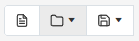

# summernote-ext-file



A plugin to add file gestion on <a href="https://github.com/summernote/summernote/">Summernote</a> WYSIWYG editor :
- Creating a new document
- Importing/Opening a text or xml files
- Exporting/Saving to text, xml, Word (doc file) or pdf files

## Installation

### 1. Include JS

```html
<!-- Dependency -->
<script src="./summernote-ext-file/vendor/docxtemplater.min.js"></script>
<script src="./summernote-ext-file/vendor/pizzip.js"></script>
<script src="./summernote-ext-file/vendor/nl2br.min.js"></script>
<script src="./summernote-ext-file/vendor/FileSaver.min.js"></script>
<script src="./summernote-ext-file/vendor/jquery.wordexport.js"></script>
<script src="./summernote-ext-file/vendor/html2canvas.min.js"></script>
<script src="./summernote-ext-file/vendor/jspdf.min.js"></script>
<!-- Main file -->
<script src="./summernote-ext-file/summernote-ext-file.js"></script>
```

### 2. Initialisation
```javascript
$(document).ready(function () {
    $('#summernote').summernote({
        height : 300,
        toolbar: [
          ['file', ['fileNew', 'fileOpen', 'fileSave']],
        ],
    });
});
```

## Access by API

You can access to these functionalities through API : 

### New file
```javascript
$('#summernote').summernote('file.fileNew');
```

### Opening file
```javascript
$('#summernote').summernote('file.fileOpen', '%TYPE%' );
```

%TYPE% can be : 
<ul>
  <li>txt : File text (.txt)</li>
  <li>xml : xml file (.smn)</li>
</ul>

### Saving file
```javascript
$('#summernote').summernote('file.fileSave', '%TYPE%' );
```

%TYPE% can be : 
<ul>
  <li>txt : File text (.txt)</li>
  <li>xml : xml file (.smn)</li>
  <li>wrd : Word file (.doc)</li>
  <li>pdf : PDF file (.pdf)</li>
</ul>


## Dependency and tested with
<ul>
  <li>Summernote : 0.8.18</li>
  <li>JQuery : 3.6.0</li>
  <li>BootStrap : 5.1.1</li>
</ul>

## Greetings
<ul>
  <li><a href="https://github.com/open-xml-templating/docxtemplater">docxtemplater</a> : library to generate docx/pptx documents</li>
  <li><a href="https://github.com/open-xml-templating/pizzip">pizzip</a> : synchronous Zip library</li>
  <li><a href="https://github.com/eligrey/FileSaver.js">FileSaver</a> : library for saving large file</li>
  <li><a href="https://github.com/markswindoll/jQuery-Word-Export">jQuery-Word-Export</a> : plugin for exporting HTML and images to a Microsoft Word document</li>
  <li><a href="jQuery-Word-Export">jspdf</a> : library to generate PDFs</li>
</ul>
